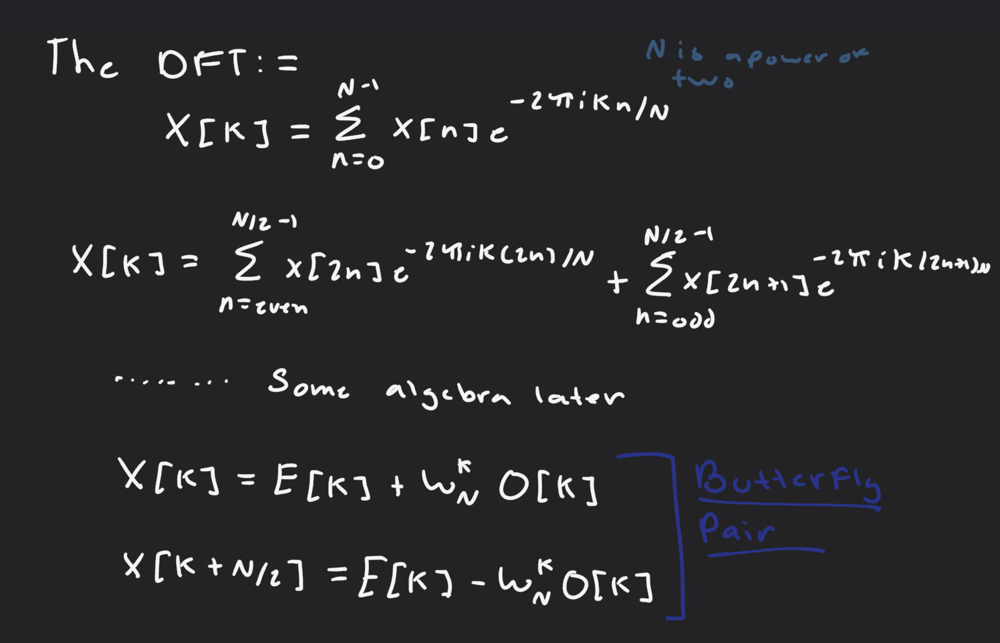
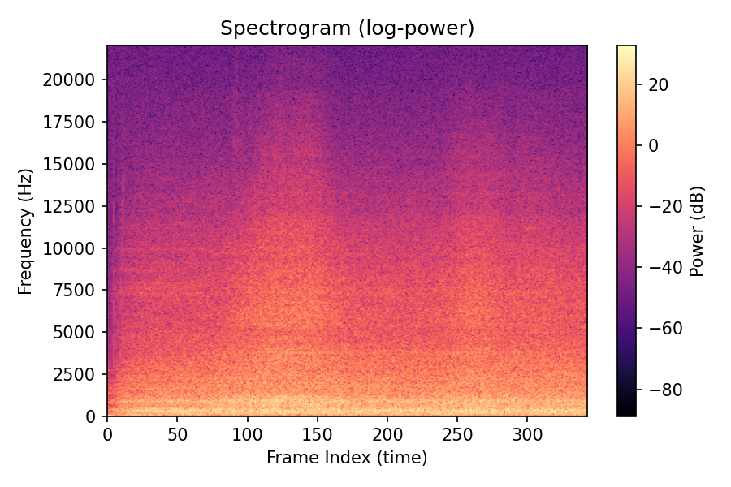

# CS147-FinalProject
Final Project For CS147 - GPU Programming

## Goal: Optimize Audio Data Pre-Proccessing for a CNN Classifier

## Introduction:

In order to be able to train a typical NN classifer to on audio, we need to both process this audio into a format that can be intepreted by a model, as well as proccess the audio into a form that carries with it information about the sample. This is where the Short Time Fourier Transform is perfect.

A typical Fourier Transform converts any signal from the time domain to the frequency domain, which then conveys how much of any given frequency is present in a given signal. While useful for simple signals, audio is very complex, in where frequencies can change throughout the lifetime of an audio sample. The STFT tells us both how much of a frequency is present in a signal, as well as **when** it is present. 

By performing a STFT on an audio signal, we obtain (usually) a 2D array containing the desired information. By taking the **Magnitude Squared**, we gain a spectrogram containing this information, which then can be passed into a NN as if it was an image.

In order to get our desired results, we must first **Window** our function, meaning we 'slice' the signal into desired frames. On each frame, we perform a **Fast Fourier Transform**, now given us both the how much and when we desire. Afterwards, we compute the spectorgram by taking the magnitude squared, and from that we achieve our proccessed audio. This must be peformed on EVERY audio sample, meaning with a GPU implementation, For a signal of size N and frame size of size M, we would need to atleast perform N/M FFT's, each which have a typical runtime of O(Nlog(n)). 

So the main steps are:
- Window
- Fast Fourier transform on num_frames
- Generate Spectrogram through magnitude squared

## Fast Fourier Transform: 

The fast fourier is a wonderful algorithm, as the inutuion behind it is simple(although everything else about it is not). For any signal X[n], we can seperate it into even and odd parts. It thene uses the idea of symetry for even an odd degree polynomials to compute a corresponding point at a given time, halving the amount of computation needed. Below is the serial imlementation I made for testing:
```
fast_fourier_transform(Complex* input, int N){
      //Root of unity 1
      if(N <= 1) return; 
          
      Complex* even = malloc(N/2 *sizeof(Complex));
      Complex* odd = malloc(N/2 *sizeof(Complex));
      for(int i = 0 ; i < N /2 ; ++i){
          even[i] = input[2*i];
          odd[i] = input[2*i+1];
      }
  
      fast_fourier_transform(even, N/2);
      fast_fourier_transform(odd, N/2);
      
       
      for (unsigned int j = 0; j < N /2 ; ++j){
          float exponent = -2 * PI * j / N;
          Complex w = {cosf(exponent),sinf(exponent)};
          Complex rhs = complex_mult(w, odd[j]);      
  
          input[j] = complex_add(even[j],rhs);
          input[j + N/2] = complex_sub(even[j],rhs);
  
      }
  
  
  
      
  
      free(even);
      free(odd);
  }
```
And here is the corresponding output:


The issue however, is that this is a sequential, recursive algorithm. And this course isn't called "sequential programming". So I had to scrap this, and learn about the **2-Radix Butterfly Algorithm**. (Which hurt alot).
## 2-Radix Butterfly Cooley Tukey

This implementation of the DFT allows us to essentially perform our fourier transforms in parralel, by handling smaller and smaller problems. 

The intuition comes from the even/odd splitting of a signal to get the following identities:

What this tells us that these indices, always a constant stride apart based on our iteration, are equal aside from the distinction of +/-. The W term is refered to as the "twiddle factor". What's fantastic about this is that we can also reuse computations for these terms.

Now, there are caveats, as it isn't so simple. Since we continously split the problem into smaller problems, we are NOT doing so recursivley. So we must use bit-magic and clever indexing to understanding where our final values should end up. 


The above diagram is an example on why exactly we need to account for bit reversals and placements. Every time we split our problem into a smaller one, we must account for its original indexing to make sure our coeffeceinets are in the right location at the very end. For example, X[0] = X[E_0] + W^0_0 X[Odd_0), but inside our smaller N/2 DFT, the indices are also switched. Below is another example


As we continue splitting in and even/odd fashion, in this simple example, the value at 0001 is actually given by loc. 1000 and so forth. 

## Indexing in the algorithm

Since we are constantly splitting the polynomial, we will have logN iteration throigh a for loop of matching butterfly pairs. at each step, we need to know s:= our current stage, m:= our current problem size, and m_half:= which is the stride in a sense. Below is a worked out example of a very simple problem size. 


We start from the very bottom, and as we iterate, extend back up to a full problem size. Our stride in stage 1 was of size 2/2=1. Our stride in stage 2 was 4/2=2. Which is why our pairs were [0,1] and [0,2] respectivley. So in each problem stage, each block handles one frame, and each thread in a block is responsible for 2 butterfly pairs at a time. 

## cuFFT Implementation
Due to my human error, I also opted ot use my original main.cu that took care of the spectrogram and windowing, and alter it slighlty to instead use the cuFFT library. cuFFT essentially performs the same task, but with other optimizations to guratnee high performance and covering all edge cases. 

To use cuFFT, one must simply specify a 'plan', with the length, along with the number of frames (number of FFT's to perform). It then handles all bit reversal and indexing issues no matter the input. It executes all frames in parralel, having the desired functionality for our high demand computations. 

In both implementations, the idea is the same. a window size of 1024, with a block size of 256. Each thread handles two butterfly pairs at a time, so each handles 2 elements each. We allocate a block per frame, so our grid is usually of frames/block size (edge cases).


## Performance and Comparison

Both implementations, (my attempted cooley-Tuket and cuFFT), were used on 7 folds of the urbansound8k data set consisting of ~4 second long audio clips. The entire data set has around 16,000 samples, so without the exact number, each processed about 11,200 audio samples. The output where raw binary samples, as the NN classifer simply needs the values, and not a literal spectrogam to "look" at. 

### cooleyTukey Runtime


This implementation took around 29 minutes to process 11,200 samples.

### cuFFT Runtime


This implementation, suprisingly, took 31 minutes, about a minute longer on the same samples. 
Below is logging of each step, where this is the typical perforamnce one one sample (as sampling rate and size time can vary):


### cuFFT: 
#### dog bark

#### dog bark 2

#### gun shot

#### jackhammer


My attemped implementation of cooley-Tukey did compile faster, however, with a MAJOR caviat. The graphs will speak for themselves

#### cooleyTukey/sample1.png

#### cuFFT/sample1.png

#### cooleyTukey/sample2.png

#### cuFFT/sample2.png


As one can see, while my implementation did run faster, the produced spectrograms are extremley different. The fast fourir algorithm is extremley complex, especially the 2-Radix version, so there are cases I didn't consider, things cuFFT does. However, I would like to note the extreme similarity between the two sample2.png's. While one is obvisouly cleaner, the "essense" of the information being captured is still present (although completley lost in sample1.png). 

## Process Summary

In the cuFFT implementation, the process goes as following:
```
1: use dr_wav to load audio into buffer

2: normalize (audio nonsense)

3: N = 1024, Hop Size = 512

4: make hanning window to cut function

5: Move signal into memory, slice up

6: transform to complex values

7: Perform STFT using cuFFT, with size N and num_frames times

8: make spectrogram using simple kernel

9: move data back

repeat above for all samples

```


## What I learned and Where to Improve

As said in the beggining of course, more lines =/= better code. As compared to the simple sequential implementation, to perform these computations in parallel took lots of problem solving. And, it all came down to indexing. Indexing the butterfly's to handle the right elements during the right phase was the trickiest part to understand and grasp. 

I also saw of course how memory movement can be a big limitation. I could've improved this implementation further by having all samples on the device. I could have also found a way to only declare the hanning window once, as that could be a bottle neck as it has to be made for every sample (honestly propbably the biggest possible improvement). 

## Compile Commands
To compile the cooley-tukey version
```
nvcc -o ct_fft main.cu support.cu -lm
```
To compile cuFFT implementation
```
nvcc -I/usr/local/cuda-12.2/targets/x86_64-linux/include main.cu support.cu -o main -lcufft
```
To compile serial version
```
gcc -std=c99 -o main main.cu 
```
(mostly for my own documentation)

## Libraries and Resources: 

- dr_wav: A single file library, included as a header (used for loaded audio into buffer)
- Cuda C for GPU programming
- Numpy and Matplot for plotting spectrogram examples
- [Understanding Bit Reversal](https://youtu.be/gg2lgResMc0?si=rUICaErpVhQTzuQ0)
- [Understanding Butterfly's](https://youtu.be/EsJGuI7e_ZQ?si=I_uGoG0PrxT4MB_7)
- [Fast Fourier Transform Abstract](https://youtu.be/h7apO7q16V0?si=3SD3Lid2BQFgZxti)
